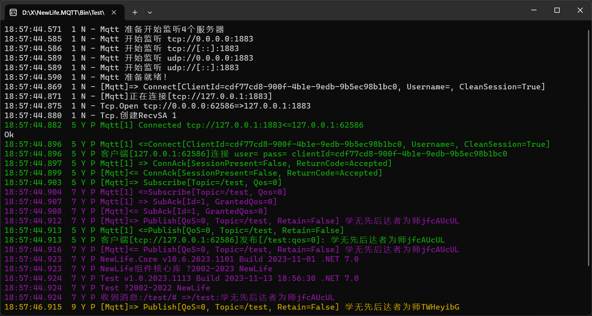

# DH.NMQTT - MQTT协议

MQTT协议是物联网领域最流行的通信协议！  
`DH.NMQTT`包含了MQTT的完整实现，并实现了客户端`MqttClient`，以及服务端`MqttServer`。  
其中MqttServer仅实现基本网络框架，支持消息收发，完整的消息交换功能位于商用版IoT平台中。  

## MQTT协议
最流行的物联网通信协议MQTT，包括客户端、服务端和Web管理平台。  

提供订阅/发布模式，更为简约、轻量，易于使用，针对受限环境（带宽低、网络延迟高、网络通信不稳定），可以简单概括为物联网打造，官方总结特点如下：  
1. 使用发布/订阅消息模式，提供一对多的消息发布，解除应用程序耦合。  
2. 对负载内容屏蔽的消息传输。  
3. 使用 TCP/IP 提供网络连接。  
4. 有三种消息发布服务质量：  
“至多一次”，消息发布完全依赖底层 TCP/IP 网络。会发生消息丢失或重复。这一级别可用于如下情况，环境传感器数据，丢失一次读记录无所谓，因为不久后还会有第二次发送。  
“至少一次”，确保消息到达，但消息重复可能会发生。  
“只有一次”，确保消息到达一次。这一级别可用于如下情况，在计费系统中，消息重复或丢失会导致不正确的结果。  
5. 小型传输，开销很小（固定长度的头部是 2 字节），协议交换最小化，以降低网络流量。  
6. 使用 Last Will 和 Testament 特性通知有关各方客户端异常中断的机制。  

## MQTT 发布与订阅
发布时，指定消息Qos，broker保存的消息包含了Qos；  
订阅时，指定这次订阅要求的Qos，broker回复授权使用的Qos，一般就是申请那个；  
消费时，消息的Qos取发布订阅中较小者！  

详细场景：  
- 订阅Qos=0，不管发布什么消息，消费到的消息Qos都是0；  
- 订阅Qos=1，发布消息Qos=0时，消费得到Qos=0，发布消息Qos=1或2时，消费得到Qos=1；  
- 订阅Qos=2，消费得到的消息Qos，就是发布时的Qos；  
- 发布Qos=0，broker不做任何答复，理论上中途丢了都不知道，但是因为Tcp，如果网络异常客户端能发现；  
- 发布Qos=1，broker答复`PubAck`，表示已经收到消息；  
- 发布Qos=2，broker答复`PubRec`，客户端再次发送`PubRel`，broker答复`PubComp`，消息才算发布完成；
- 订阅Qos=2，broker推送Qos=2消息，客户端先回`PubRec`，broker再次发送`PubRel`，客户端答复`PubComp`，消息才算消费完成；  
- 发布Qos=2消息时，双重确认流程不需要等消费端在线，仅限于发布者与broker之间即可完成。  

## 快速尝鲜
打开源码解决方案，把Test设为启动项目，启动即可。  
默认先后启动TestServer和TestClient。  
  

## 服务端
Nuget引用`DH.NMQTT`，使用以下代码启动服务端：
```csharp
var services = ObjectContainer.Current;
services.AddSingleton<ILog>(XTrace.Log);
services.AddTransient<IMqttHandler, MqttHandler>();
services.AddSingleton<MqttExchange, MqttExchange>();

var server = new MqttServer
{
    Port = 1883,
    ServiceProvider = services.BuildServiceProvider(),

    Log = XTrace.Log,
    SessionLog = XTrace.Log,
};
server.Start();
```
通过指定端口1883，默认处理器`MqttHandler`，默认交换机`MqttExchange`，启动服务端。  

## 客户端
Nuget引用`DH.NMQTT`，使用以下代码连接服务端：
```csharp
var client = new MqttClient
{
    Log = XTrace.Log,
    Server = "tcp://127.0.0.1:1883",
    //UserName = "admin",
    //Password = "admin",
    ClientId = Guid.NewGuid() + "",
};

await client.ConnectAsync();

// 订阅“/test”主题
var rt = await client.SubscribeAsync("/test", (e) =>
{
    XTrace.WriteLine("收到消息:" + "/test/# =>" + e.Topic + ":" + e.Payload.ToStr());
});

// 每2秒向“/test”主题发布一条消息
while (true)
{
    try
    {
        var msg = "学无先后达者为师" + Rand.NextString(8);
        await client.PublishAsync("/test", msg);
    }
    catch (Exception ex)
    {
        XTrace.WriteException(ex);
    }
    await Task.Delay(2000);
}
```
客户端连接服务端有几个要素：`服务端地址`、`用户名`、`密码`、`客户端标识`，然后通过`ConnectAsync`连接服务端。  
客户端可以是消费者角色，通过`SubscribeAsync`订阅指定Topic。  
客户端也可以是生产者角色，通过`PublishAsync`发布消息到指定Topic。  

## 自定义服务端
需要在服务端处理客户端连接和消息交互逻辑时，就需要自定义服务端。例如IoT平台，在收到设备上报MQTT数据以后，直接接收落库，而不需要再次消费。  
自定义处理器示例如下：
```csharp
private class MyHandler : MqttHandler
{
    private readonly ILog _log;

    public MyHandler(ILog log) => _log = log;

    protected override ConnAck OnConnect(ConnectMessage message)
    {
        _log.Info("客户端[{0}]连接 user={1} pass={2} clientId={3}", Session.Remote.EndPoint, message.Username, message.Password, message.ClientId);

        return base.OnConnect(message);
    }

    protected override MqttMessage OnDisconnect(DisconnectMessage message)
    {
        _log.Info("客户端[{0}]断开", Session.Remote);

        return base.OnDisconnect(message);
    }

    protected override MqttIdMessage OnPublish(PublishMessage message)
    {
        _log.Info("客户端[{0}]发布[{1}:qos={2}]: {3}", Session.Remote, message.Topic, (Int32)message.QoS, message.Payload.ToStr());

        return base.OnPublish(message);
    }
}
```
稍微修改一下服务端注入处理器的代码即可使用自定义处理器：
```csharp
var services = ObjectContainer.Current;
services.AddSingleton<ILog>(XTrace.Log);
services.AddTransient<IMqttHandler, MyHandler>();
services.AddSingleton<MqttExchange, MqttExchange>();

var server = new MqttServer
{
    Port = 1883,
    ServiceProvider = services.BuildServiceProvider(),

    Log = XTrace.Log,
    SessionLog = XTrace.Log,
};
server.Start();
```

## 集群
集群管理，Join、Ping、Lease。  
Join加入集群，告诉对方我是集群节点之一，启动时调用N-1次。  
每15秒Ping一次所有节点，更新活跃时间。  
Lease离开集群，调用N-1次。  
每个节点根据最后活跃时间，定时剔除超时节点。  